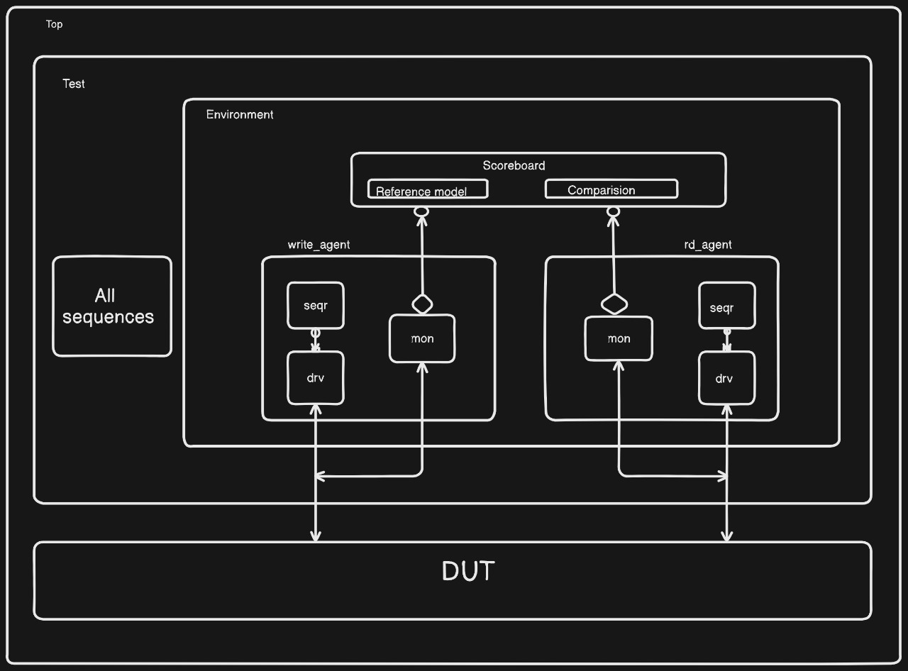

# FIFO Memory Verification Project

## Overview
This project implements and verifies a synchronous FIFO memory with a depth of 16 entries using UVM methodology. The verification environment is designed to thoroughly test all FIFO functionalities including overflow/underflow conditions, pointer wraparound, and various corner cases.

## Features Verified
- Basic read/write operations
- Full and empty flag assertions
- Reset behavior verification
- Pointer wraparound testing
- Back-to-back operations

## RTL Specifications
- 8-bit data width
- 16 entries deep
- Synchronous clock domain
- Active-high reset
- Full/Empty status flags
- Read/Write enable controls
- 5-bit read/write pointers (4 bits for addressing, 1 bit for wrap detection)

## Verification Environment
### Architecture


The verification environment consists of:
- Separate read and write agents
- Scoreboard for checking data integrity
- Coverage collector
- Configuration database for test parameters

### Components
1. Write Agent
   - Write sequencer
   - Write driver
   - Write monitor
   - Write sequences for various scenarios

2. Read Agent
   - Read sequencer
   - Read driver
   - Read monitor
   - Read sequences

3. Environment
   - Scoreboard
   - Coverage collector
   - Configuration object

### Test Scenarios
1. Basic Tests
   - Reset test
   - Single write/read

2. Corner Cases
   - Full FIFO write attempt
   - Empty FIFO read attempt
   - Pointer wraparound
   - Back-to-back operations

## Coverage Metrics
- Functional coverage for:
  - Full/Empty conditions
  - Pointer wraparound
  - Concurrent operations
  - Data patterns

## Assertions
- Protocol checks:
  - Reset behavior
  - Write pointer update
  - Read pointer update
  - Full/Empty conditions
- Functional checks:
  - Flag (Empty,Full) accuracy
- Liveness properties:
  - Eventually read after write
  - Reset completion

## Running Tests
```bash
# Go to the make file for more information
cd sim
make clean
make regress # run all the test
```

## Directory Structure
```
FIFO_UVM/
├── rd_agt/
│   ├── read_agent.sv
│   ├── read_driver.sv
│   ├── read_monitor.sv
│   └── read_sequencer.sv
├── wr_agt/
│   ├── write_agent.sv
│   ├── write_driver.sv
│   ├── write_monitor.sv
│   └── write_sequencer.sv
├── env/
│   ├── fifo_env.sv
│   ├── fifo_scoreboard.sv
│   └── virtual_sequencer.sv
├── test/
│   ├── fifo_base_test.sv
│   ├── basic_test.sv
│   └── corner_case_test.sv
├── rtl/
│   └── fifo.sv
├── sim/
│   ├── Makefile
│   └── run.do
└── README.md
```

## Results
- All test scenarios passing
- Coverage goals met
- Assertion checks successful
- Detailed reports available in the reports directory

## Known Limitations
- Single clock domain only
- Fixed FIFO depth
