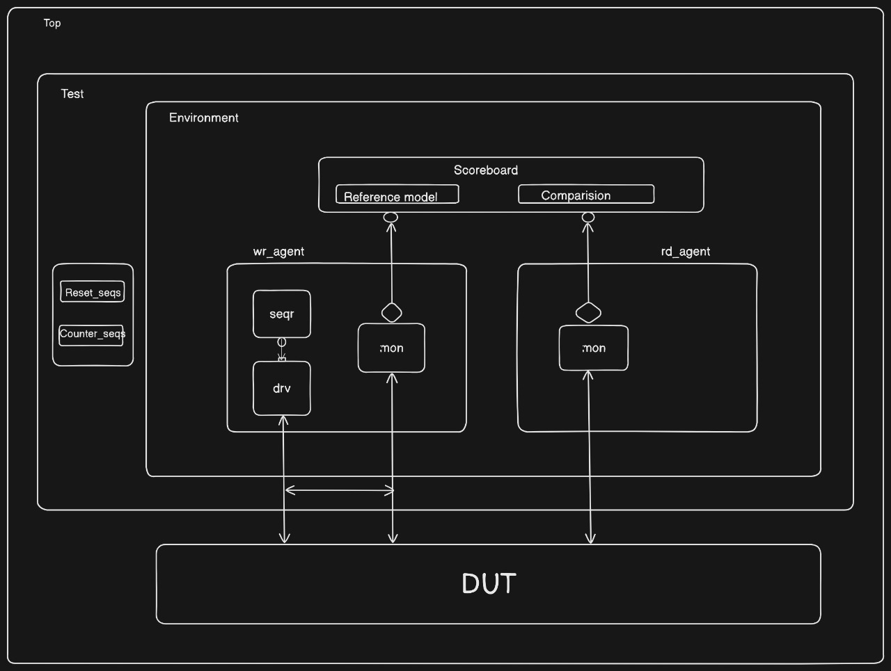

# Module-12 Loadable Up/Down Counter with UVM Verification

## Overview
This project implements and verifies a 4-bit loadable up/down counter with mod-12 functionality using UVM. The design features configurable up/down counting modes and load capability, verified using a dual-agent UVM testbench architecture.

## RTL Design
```systemverilog
module counter (
    input clk,
    input load,
    input mode,
    input reset,
    input [3:0] data_in,
    output logic [3:0] data_out
);
  always_ff @(posedge clk) begin
    if (reset) begin
      data_out <= 4'd0;
    end else if (load) begin
      data_out <= data_in;
    end else begin
      // mode = 1 ,up counter
      if (mode) begin
        if (data_out == 4'd11) begin
          data_out <= 4'd0;
        end else begin
          data_out <= data_out + 4'd1;
        end
      // mode = 0 , down counter
      end else begin
        if (data_out == 0) begin
          data_out <= 4'd11;
        end else begin
          data_out <= data_out - 4'd1;
        end
      end
    end
  end
endmodule : counter
```

## Directory Structure
```
├── env/
│   ├── env_config.sv
│   ├── env.sv
│   └── scoreboard.sv
├── rd_agt/
│   ├── rd_agent.sv
│   └── rd_monitor.sv
├── wr_agt/
│   ├── counter_seqs.sv
│   ├── sequencer.sv
│   ├── trans.sv
│   ├── wr_agent.sv
│   ├── wr_driver.sv
│   ├── wr_monitor.sv
│   └── wr_sequencer.sv
├── test/
│   └── base_test.sv
├── top/
│   ├── counter_pkg.sv
│   └── top.sv
├── rtl/
│   ├── counter.sv
│   └── count_if.sv
├── sim/
│   └── Makefile.txt
└── report/
    └── index.html
```

## Testbench Architecture


### Key Components

#### 1. Agents
- **Write Agent (Active)**
  - Write Driver
  - Write Monitor
  - Write Sequencer
  - Generates and drives stimulus to DUT
- **Read Agent (Passive)**
  - Read Monitor
  - Observes DUT outputs

#### 2. Environment
- Contains both agents
- Scoreboard for checking
- Environment configuration

#### 3. Sequences
- Reset Sequence
- Counter Sequence (randomized transactions)

#### 4. Scoreboard
- Reference Model
- Comparison Logic
- Result Checking

## UVM Topology
```
uvm_test_top (base_test)
└── env_h (env)
    ├── wr_agt_h (wr_agent)
    │   ├── drv_h (wr_driver)
    │   ├── mon_h (wr_monitor)
    │   └── seqr_h (wr_sequencer)
    ├── rd_agt_h (rd_agent)
    │   └── mon_h (rd_monitor)
    └── sb_h (scoreboard)
        ├── wr_mon_fifo
        └── rd_mon_fifo
```

## Features
- Mod-12 counting (0-11)
- Up/Down counting modes
- Synchronous load functionality
- Reset capability
- Comprehensive coverage metrics

## Verification Features
1. **Configuration**
   - Environment configuration through UVM config DB
   - Virtual interface distribution
   - Agent configuration

2. **Stimulus Generation**
   - Random stimulus for all inputs
   - Directed test sequences
   - Corner case scenarios

3. **Checking**
   - Protocol checking
   - Functional checking
   - Coverage collection

4. **Coverage Metrics**
   - Functional coverage
   - Code coverage
   - Toggle coverage
   - FSM coverage

## Running Simulation
1. Navigate to simulation directory:
```bash
cd sim
```

2. Run simulation:
```bash
# For more details check the Makefile isdie the sim directory
make run_test
```

## Viewing Coverage Reports
1. Navigate to report directory:
```bash
cd ../report
```

2. Open coverage report:
```bash
firefox index.html  # or your preferred browser
```

## Available Coverage Reports
- Assertion Coverage
- Functional Coverage

## Requirements
- UVM 1.2 or later
- SystemVerilog compatible simulator
- Make utility

