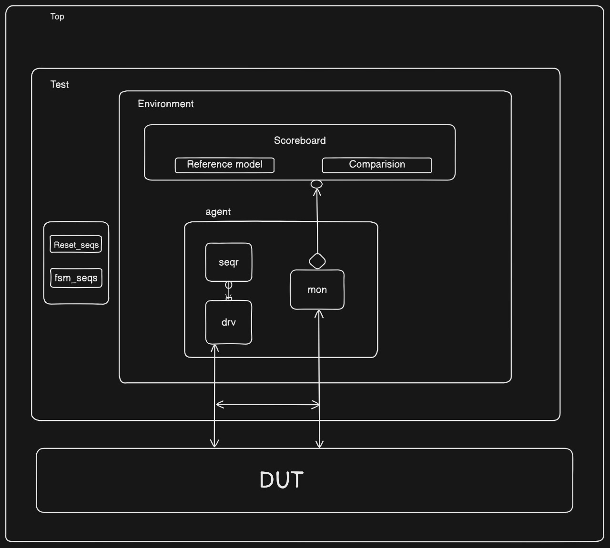
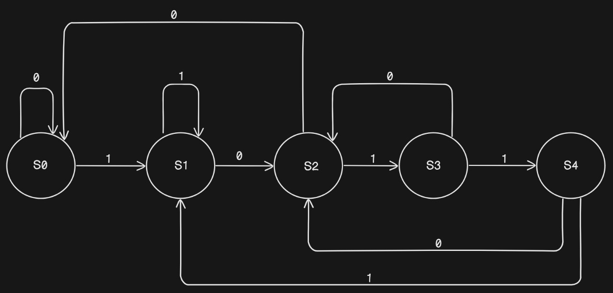

# Pattern Detection FSM (1011) with UVM Verification
## Overview
This project implements and verifies a Finite State Machine (FSM) that detects the pattern "1011" in a serial input stream using UVM. The design features a 5-state FSM with comprehensive assertions and coverage metrics, verified using a UVM testbench architecture.

## RTL Design
```systemverilog
module fsm (
    input logic clk,
    input logic reset,
    input logic in,
    output logic out
);
  logic [2:0] present_state, next_state;
  parameter bit [2:0] S0 = 0, S1 = 1, S2 = 2, S3 = 3, S4 = 4;

  always_ff @(posedge clk) begin : Register_logic
    if (reset) begin
      present_state <= S0;
    end else begin
      present_state <= next_state;
    end
  end

  always_comb begin : next_state_logic
    case (present_state)
      S0: next_state = in ? S1 : S0;
      S1: next_state = in ? S1 : S2;
      S2: next_state = in ? S3 : S0;
      S3: next_state = in ? S4 : S2;
      S4: next_state = in ? S1 : S2;
      default: next_state = S0;
    endcase
  end

  assign out = (present_state == S4);
endmodule
```

## Directory Structure
```
├── agt/
│   ├── fsm_agent.sv
│   ├── fsm_driver.sv
│   ├── fsm_monitor.sv
│   ├── fsm_sequencer.sv
│   └── fsm_trans.sv
├── env/
│   ├── env_config.sv
│   ├── env.sv
│   └── scoreboard.sv
├── test/
│   └── base_test.sv
├── top/
│   ├── fsm_pkg.sv
│   └── top.sv
├── rtl/
│   ├── fsm.sv
│   └── fsm_if.sv
├── sim/
│   └── Makefile
├── report/
│   └── index.html
└── arch.jpeg
```

## Testbench Architecture


## State Diagram


### Key Components
#### 1. Agent
- **FSM Agent**
  - Driver
  - Monitor
  - Sequencer
  - Transaction class
  - Generates serial bit stream and monitors output

#### 2. Environment
- Contains FSM agent
- Scoreboard for pattern detection verification
- Environment configuration

#### 3. Sequences
- Reset Sequence
- Random Pattern Sequence

#### 4. Scoreboard
- Reference Model for pattern detection
- Comparison Logic
- Result Checking
- Pattern tracking

## Design Features
- 5-state FSM implementation
- Pattern detection for "1011"
- Synchronous reset
- Output assertion when pattern detected
- Comprehensive state transition coverage
- Built-in assertions for verification

## Verification Features
1. **Assertions**
   - State transition assertions
   - Output verification
   - Reset behavior
   - Pattern detection correctness

2. **Coverage Metrics**
   - Functional coverage
   - Input pattern coverage
   - Output detection coverage

3. **Test Scenarios**
   - Basic pattern detection
   - Overlapping patterns
   - Reset during pattern
   - Random input streams

4. **Checking Mechanisms**
   - Pattern detection verification
   - Reset functionality

## Running Simulation
1. Navigate to simulation directory:
```bash
cd sim
```

2. Run simulation:
```bash
# For detailed options, check the Makefile
make run_test
```

## Viewing Coverage Reports
1. Navigate to report directory:
```bash
cd ../report
```

2. Open coverage report:
```bash
firefox index.html  # or your preferred browser
```

## Available Coverage Reports
- Assertion Coverage
- Functional Coverage

## Requirements
- UVM 1.2 or later
- SystemVerilog compatible simulator (QuestaSim/ModelSim)
- Make utility
- Waveform viewer

## Key Features Verified
- Pattern "1011" detection
- Proper state transitions
- Reset behavior
- Overlapping pattern handling
- Edge case handling
