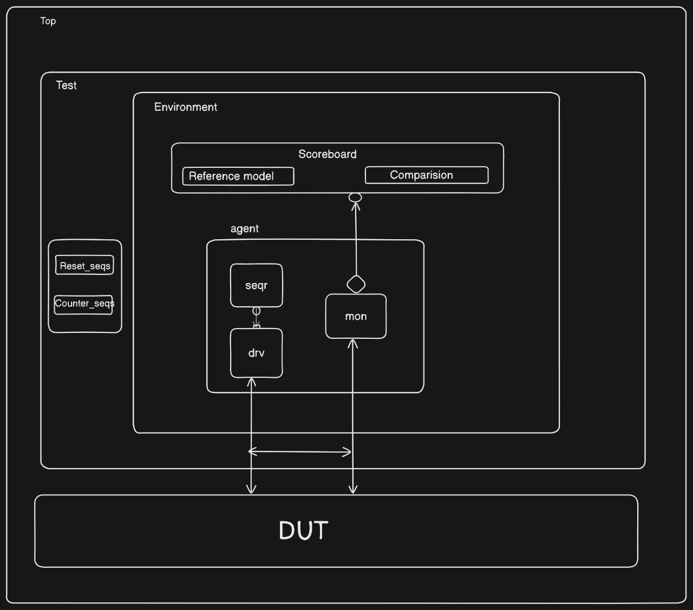

# 4-Bit Up Counter with UVM Verification

## Overview
This project implements and verifies a 4-bit up counter using the Universal Verification Methodology (UVM). The design includes a simple synchronous counter with reset functionality, verified using a comprehensive UVM testbench.

## RTL Design
```systemverilog
module counter (
    clk,
    rst_h,
    out
);
  input logic clk, rst_h;
  output logic [3:0] out;
  always_ff @(posedge clk or posedge rst_h) begin
    if (rst_h) begin
      out <= 4'b0;
    end else begin
      out <= out + 1;
    end
  end
endmodule
```

## Directory Structure
```
├── agt
│   ├── agent.sv
│   ├── counter_seqs.sv
│   ├── driver.sv
│   ├── monitor.sv
│   ├── sequencer.sv
│   └── trans.sv
├── env
│   ├── env_config.sv
│   ├── env.sv
│   └── scoreboard.sv
├── report
│   └── index.html
├── rtl
│   ├── counter_if.sv
│   └── counter.sv
├── sim
│   └── Makefile
├── test
│   └── base_test.sv
└── top
    ├── counter_pkg.sv
    └── top.sv
```

## Testbench Architecture


### Top Level Components
- **TB Top**: Connects DUT, interface, and testbench assertions
- **Interface**: Contains signals clocking blocks and modports
- **Base Test**: Configures and runs the test environment

### Environment Components
- **Environment**: Contains agent and scoreboard
- **Environment Config**: Handles configuration settings and virtual interface

### Agent Components (Active)
- **Driver**: Drives stimulus to DUT
- **Monitor**: Observes DUT signals
- **Sequencer**: Controls transaction flow
- **Sequences**:
  - Reset Sequence: Handles reset scenarios
  - Counter Sequence: Generates random transactions

### Scoreboard
- Reference Model
- Comparison Logic
- Results Checking

## UVM Topology
```
uvm_test_top (base_test)
└── env_h (env)
    ├── agt_h (agent)
    │   ├── drv_h (driver)
    │   │   ├── rsp_port
    │   │   └── seq_item_port
    │   ├── mon_h (monitor)
    │   │   └── mon_port
    │   └── seqr_h (sequencer)
    │       ├── rsp_export
    │       └── seq_item_export
    └── sb_h (scoreboard)
        └── mon_fifo
```

## Features
- Complete UVM verification environment
- Random stimulus generation
- Comprehensive assertion coverage
- Reference model implementation
- Full coverage reporting

## Simulation
To run the simulation:
1. Navigate to the sim directory
```bash
cd sim
```
2. Run simulation using make
```bash
# for running base test and refer the make file for more info
make run_test
```

## Coverage Report
To view coverage results:
1. Navigate to reports directory
2. Open index.html in a web browser
```bash
cd ../reports
firefox index.html  # or your preferred browser
```

## Requirements
- UVM 1.2 or later
- SystemVerilog compatible simulator
- Make utility

## Additional Documentation
- Refer to the included architecture diagram (tb_architecture.png) for detailed testbench connections
- Coverage reports available in reports/index.html
- For Waveforms refer to the include Waveforms.png file

## Assertions
Key assertions implemented in the top module:
- Reset check

